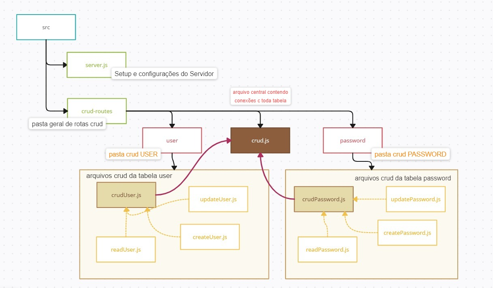

# Website Cedir 🖥️💾💻 (backend) 

Desenvolvido por [Klayvem Guimarães](https://github.com/KlayvemGuimaraes) e [Rayssa Buarque](https://github.com/RayssaBuarque)

## NOTAS:

Remover o healthCheck após o desenvolvimento

# Comando pra criar migrate
npx prisma migrate dev

# Comando pra rodar o servidor
npm run dev

# Rodar a base de dados na web
npx prisma studio

# Klayvem : 

- reformular a forma que os usuários colocam as datas

# Rayssa : 
